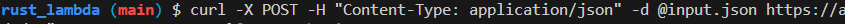
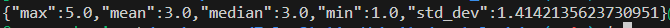
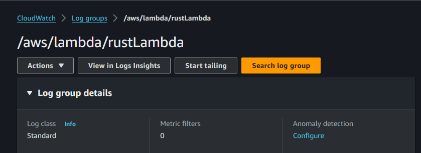
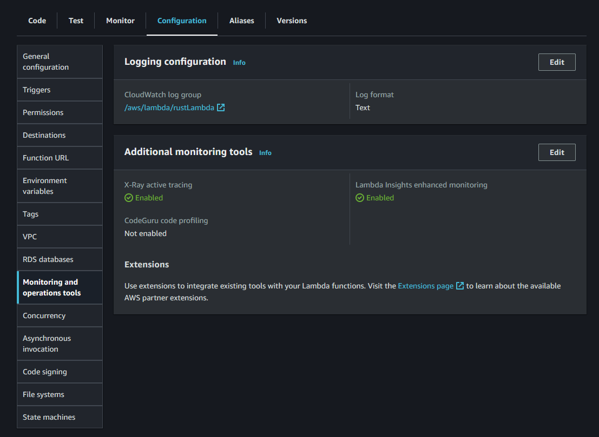

# Rust Lambda Function for Summary Statistics

This project is a Rust-based AWS Lambda function that calculates summary statistics from a JSON input file and writes the results to an output text file.

## Getting Started

### Prerequisites

- Rust: You can install Rust from the official website [here](https://www.rust-lang.org/tools/install).
- AWS CLI: You can install AWS CLI from the official AWS guide [here](https://aws.amazon.com/cli/).
- AWS SAM CLI: You can install AWS SAM CLI from the official AWS guide [here](https://docs.aws.amazon.com/serverless-application-model/latest/developerguide/serverless-sam-cli-install.html).

### Dependencies

This project uses the following Rust crates:

- `anyhow`
- `lambda_runtime`
- `log`
- `serde_json`
- `tokio`
- `env_logger`

You can add these dependencies to your project by including them in your `Cargo.toml` file.

### Installation

1. Clone the repository:

```bash
git clone https://gitlab.com/osama-shawir/rust-lambda-function.git
cd rust-lambda-function
```

2. Build the project:

```bash
cargo build --release
```

3. Create a deployment package:

```bash
zip function.zip target/release/rust-lambda-function
```

4. Create a new Lambda function:

```bash
aws lambda create-function --function-name rust-lambda-function --handler doesn't.matter --zip-file fileb://function.zip --runtime provided --role arn:aws:iam::YOUR_AWS_ACCOUNT_ID:role/service-role/YourServiceRoleForLambda
```

Replace YOUR_AWS_ACCOUNT_ID with your AWS account ID and YourServiceRoleForLambda with your Lambda service role.

### Testing

After deploying the Lambda function, you can test it by invoking it with a JSON file as input:

```bash
aws lambda invoke --function-name rust-lambda-function --payload file://input.json output.txt
```
Replace input.json with the path to your input JSON file. The results will be written to output.txt.
To expose your function via HTTP, you can create an API Gateway and connect it to your Lambda function. The input JSON file can be sent as a POST request to the API Gateway endpoint and the results will be returned in the response. For security reasons, we will not be posting the API gateway constructed for this project publically here, but a screenshot with redacted information can be found below.


#### Request:



#### Response:



#### Sample input JSON file:

```json

[1.0, 2.0, 3.0, 4.0, 5.0]

```

#### Sample output text file:

```txt
{"max":5.0,"mean":3.0,"median":3.0,"min":1.0,"std_dev":1.4142135623730951}
```

### Logging and Monitoring

This Rust code uses the `log` and `env_logger` crates for logging. The `log` crate provides a set of logging macros (like `info!`) for different log levels, and `env_logger` is a logger implementation for `log` that can be configured via environment variables.

In the `main` function, `env_logger::init()` is called to initialize the global logger. This logger will capture any log messages generated by the `info!` macro (or other macros like `debug!`, `warn!`, etc., depending on the log level) and send them to the standard output.

When this code is run as a Lambda function, AWS Lambda automatically redirects anything written to standard output to CloudWatch Logs. This means that any log messages generated by your code will automatically appear in CloudWatch Logs without any additional configuration.

In the `func` function, the `info!` macro is used to log the received event. This log message will be sent to CloudWatch Logs whenever the Lambda function is executed.

To view these logs, you can go to the CloudWatch console in AWS, navigate to "Logs", and then find the log group for your Lambda function. The log group for a Lambda function is usually named `/aws/lambda/<your-function-name>`. In this case, you would look for `/aws/lambda/RustLambda`.

Remember to set the `RUST_LOG` environment variable in your Lambda function configuration to control the log level. For example, setting `RUST_LOG=info` will log all messages with `info!`, `warn!`, `error!`, etc., but not `debug!`.



### X-Ray Tracing

This AWS Lambda function has active AWS X-Ray tracing enabled. This can be activated in the AWS Console by following these steps:

1. Navigate to the AWS Lambda service in the AWS Console.
2. Select the function for which you want to enable X-Ray tracing.
3. In the "Configuration" tab, select "Monitoring and operations tools".
4. In the "AWS X-Ray" section, select "Enable active tracing".

The screenshot below shows the configuration for enabling active tracing in the AWS Console.



Once active tracing is enabled, AWS X-Ray collects data about the requests that your application serves and provides tools you can use to view, filter, and gain insights into that data to identify issues and opportunities for optimization.

You can view the X-Ray insights in the AWS X-Ray Console by following these steps:

1. Navigate to the AWS X-Ray service in the AWS Console.
2. In the "Service map" or "Traces" sections, you can view the traces for your Lambda function.

By using AWS X-Ray, you can achieve the following:

- **Understand application behavior**: You can see how requests flow through your application to identify bottlenecks and latencies.
- **Troubleshoot issues**: You can use the detailed information provided by X-Ray to troubleshoot performance issues and errors.
- **Optimize performance**: By understanding where bottlenecks are occurring, you can optimize your application to improve performance.

However, it's important to note that as of now, there's no official AWS X-Ray SDK for Rust. This means that you can't manually instrument your code to create custom segments or subsegments, which can provide more detailed tracing information. You can only rely on the automatic instrumentation provided by AWS Lambda, which includes information about the Lambda service and the function execution, but not about the internal workings of your code.